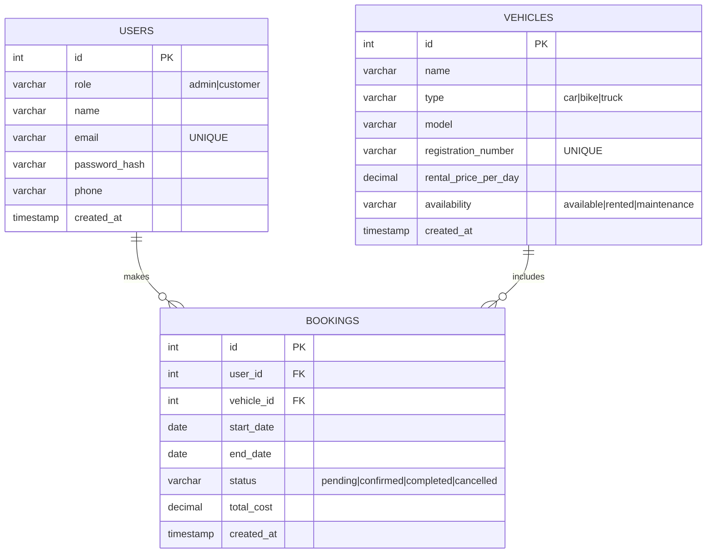

## Vehicle Rental System ERD & Notes

- Entities: `users`, `vehicles`, `bookings`.
- Keys: surrogate PKs on each table; unique email per user; unique registration number per vehicle; FKs from `bookings.user_id` → `users.id` and `bookings.vehicle_id` → `vehicles.id`.
- Status fields: `users.role` (admin|customer), `vehicles.availability` (available|rented|maintenance), `bookings.status` (pending|confirmed|completed|cancelled).
- Lucidchart: recreate the ERD below in Lucidchart and publish a view-only link. Add it beside `Public ERD link:` once you have it.

Relationship summary:
- One user can make many bookings (`users.id` → `bookings.user_id`).
- Each booking references exactly one vehicle (`vehicles.id` → `bookings.vehicle_id`), and vehicles can appear in many bookings over time.
- The logical 1-to-1 for any booking is a single user + a single vehicle.
ERD LINK:https://drawsql.app/teams/team-5560/diagrams/vehicle-rental
